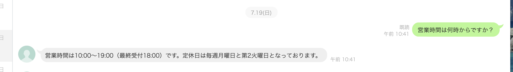
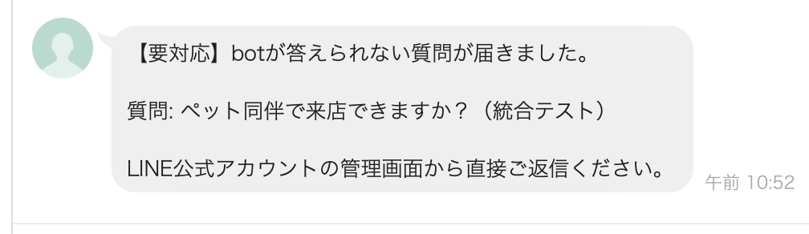
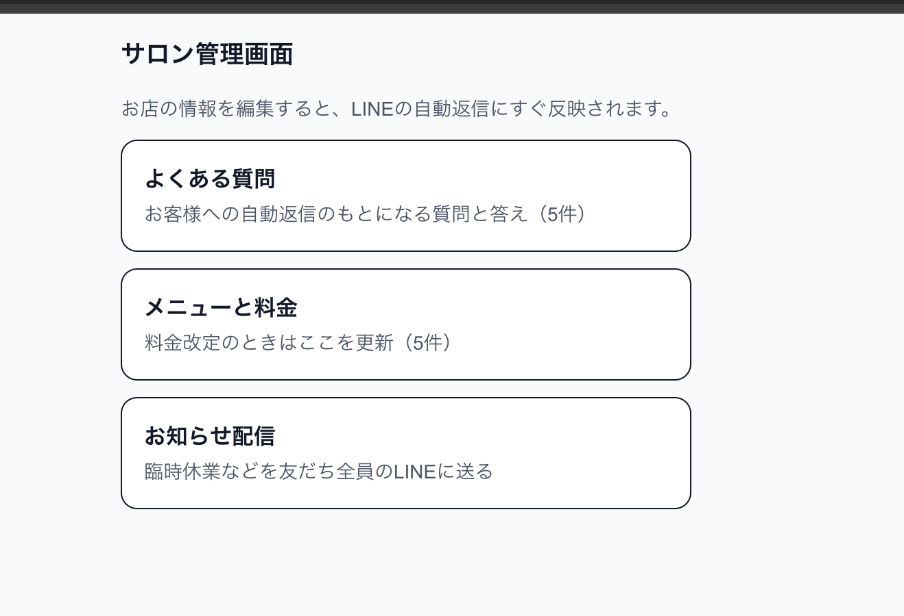

# salon-line-bot — 美容室LINE bot + AI自動応答

美容室オーナー向けの LINE 公式アカウント自動応答システム。
よくある質問（営業時間・料金・駐車場など）に AI が自動回答し、答えられない質問はオーナーの LINE に通知します。FAQ・メニューはスマホの管理画面から更新でき、臨時休業などのお知らせ一斉配信もできます。

**公開URL**: https://salon-line-bot-five.vercel.app （管理画面。Basic認証つき）

## ドキュメント

| 対象 | ドキュメント |
|---|---|
| 発注に至る資料 | [要件定義](docs/requirements.md) ／ [提案書](docs/proposal.md) ／ [WBS](docs/wbs.md) |
| オーナー（クライアント） | [操作マニュアル](docs/handover.md) |
| 開発引き継ぎ | [セットアップ手順書](docs/setup.md) ／ [技術ドキュメント](docs/technical.md)（API仕様・DB設計・構成図） |
| 品質・振り返り | [統合テスト報告書](docs/test-report.md) ／ [振り返りメモ](docs/retrospective.md) |

## スクリーンショット

<!-- TODO(スマホで撮影して docs/images/ に置き、下のコメントを外す)
| LINE自動応答 | エスカレーション通知 | 管理画面 |
|---|---|---|
|  |  |  |
-->
※実機LINEでの自動応答・【要対応】通知・管理画面のキャプチャを掲載予定

## 構成

```
LINE Messaging API → /api/webhook (署名検証 → 即200 → after()でAI処理)
                          ↓
                    Claude API（FAQ+メニューを根拠に回答+確信度判定）
                          ↓
        ┌─ 確信度 high/medium → replyMessageで自動回答
        └─ 確信度 low        → 「オーナーが確認します」+ オーナーへpush通知
                          ↓
                Supabase conversations に全会話ログ保存

/admin（Basic認証） → FAQ・メニュー編集（Server Actions）+ お知らせ一斉配信
```

| 層 | 技術 |
|---|---|
| フロント/API | Next.js 16 (App Router) + TypeScript + Tailwind CSS / Vercel |
| DB | Supabase（faq / menus / conversations。RLS有効・ポリシーなし＝service roleのみ） |
| AI | Claude API（`CLAUDE_MODEL` で切替、デフォルト claude-sonnet-5。構造化出力で回答と確信度を同時生成） |
| LINE | LINE Messaging API（reply / push / broadcast） |

## 主要ファイル

- `app/api/webhook/route.ts` — LINE Webhook。署名検証→即200→`after()`で応答生成（LINEタイムアウト対策）
- `app/admin/` — 管理画面（FAQ / メニュー / お知らせ配信）。スマホ375px基準
- `proxy.ts` — `/admin` 配下のBasic認証（Next.js 16でmiddlewareから改称）
- `lib/line.ts` / `lib/claude.ts` / `lib/supabase.ts` — 外部サービスクライアント
- `docs/sql/` — Supabaseスキーマ（001）と初期データ（002）

## 環境変数（.env.local / Vercel）

| 変数 | 内容 |
|---|---|
| `LINE_CHANNEL_SECRET` | LINEチャネルシークレット（署名検証用） |
| `LINE_CHANNEL_ACCESS_TOKEN` | LINEチャネルアクセストークン |
| `ANTHROPIC_API_KEY` | Claude APIキー |
| `CLAUDE_MODEL` | （任意）使用モデル。未設定なら claude-sonnet-5 |
| `NEXT_PUBLIC_SUPABASE_URL` | SupabaseプロジェクトURL |
| `NEXT_PUBLIC_SUPABASE_ANON_KEY` | Supabase公開キー（現状未使用・将来用） |
| `SUPABASE_SERVICE_ROLE_KEY` | Supabase秘密キー（サーバー専用） |
| `OWNER_LINE_USER_ID` | エスカレーション通知先（オーナーのLINE userId） |
| `ADMIN_PASSWORD` | 管理画面のBasic認証パスワード |

キーはコードに直書きせず、必ず環境変数で管理する（値をログに出さない）。

## 開発

```bash
npm install
npm run dev    # http://localhost:3000
npm run build  # 型チェック込みビルド
```

Webhookのローカル検証は、チャネルシークレットでHMAC-SHA256署名を付けたPOSTを `/api/webhook` に送る（LINEの本番Webhook URLはVercelを向いているため、ローカルにはLINEからのイベントは届かない）。

## デプロイ・運用

- `main` へのpushでVercelが自動デプロイ。環境変数変更時はVercelでRedeployが必要
- LINE Webhook URL: `https://<デプロイ先>/api/webhook`（LINE Developersで設定。応答メッセージOFF/Webhook ON）
- 運用コスト: Claude API従量課金のみ（他は無料枠）。一斉配信を使う月はLINEの有料プラン（月200通超の場合）が必要
- FAQ・メニュー・配信の日常操作は [docs/handover.md](docs/handover.md) を参照
